# Coronavirus (COVID-19) Data Exploration and Visualization Project

This is the Data Exploration and Visualization Project on Covid-19 Dataset done using MS Excel, Microsoft SQL Server Management Studio and Tableau.

# Steps for Exploration and Visualization are as follows :

1. Got the Dataset from the source.
2. Cleaned the Dataset in MS Excel.
3. Divided the Dataset into two excel sheets - 
  i.) Covid_Deaths.
  ii.) Covid_Vaccinations.
4. Imported Datasets into SQL SMS.
5. Done Data Exploration using SQL Queries.
6. Created four Tableau Queries in SQL SMS for Excel Sheets.
7. Done Visualization on Tableau of four tables.
8. Created Tableau Dashboard.

# Dataset Source Website - https://ourworldindata.org/covid-deaths

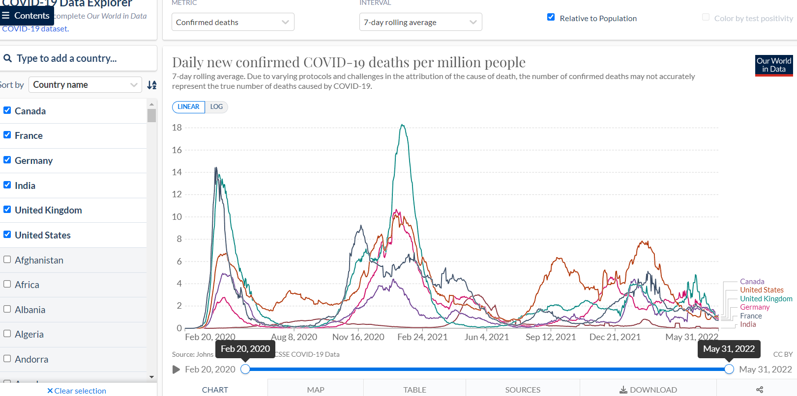

# Excel Covid 19 Source Data Spreadsheet

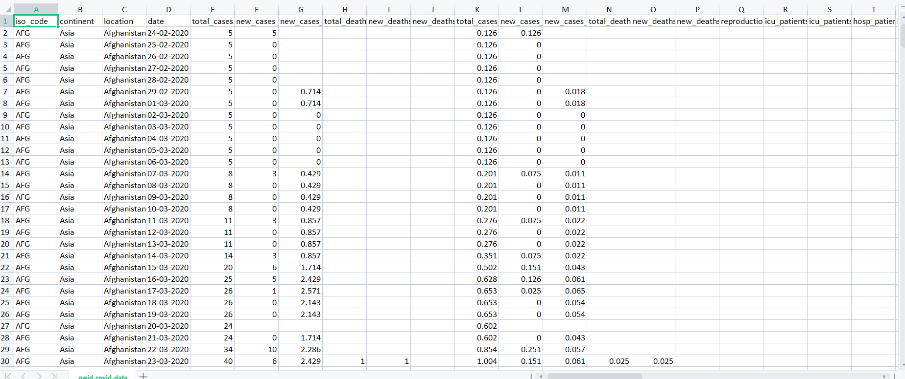

In this project, Analysed the COVID 19 Deaths and Vaccination given to people all over the world.

# Divided Source Excel Sheet into 2 Sheets : Covid_Deaths and Covid_Vaccinations

## Covid Deaths

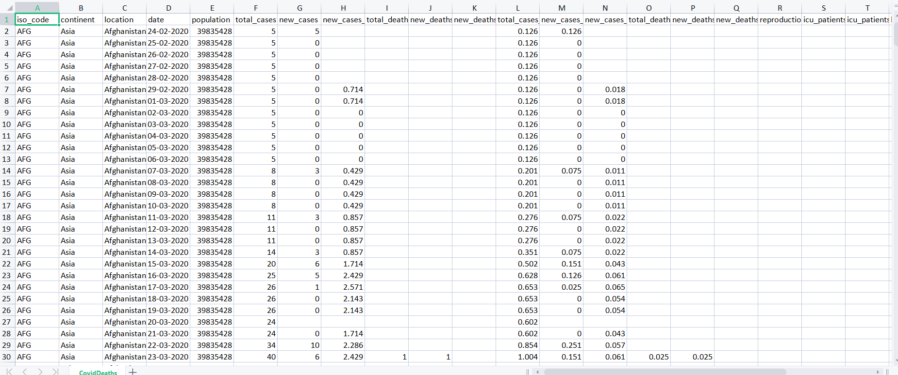

## Covid Vaccinations

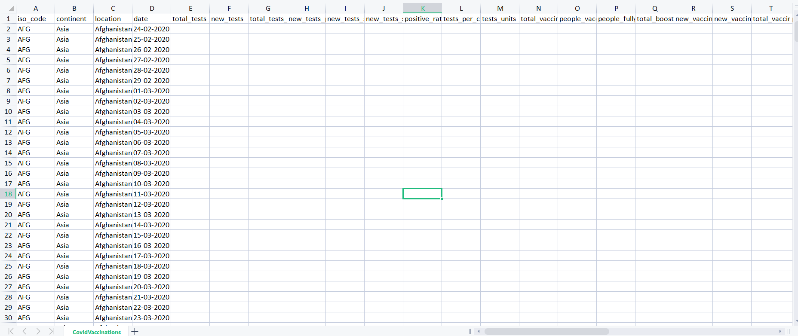

# Analysed the data using SQL queries, using CTE and created Temp Table, view to store data for later visualization in Tableau.

In MS SQL Server Management Studio created queries to analyze data of two tables : 
CovidDeaths and CovidVaccinations

## SQL Queries

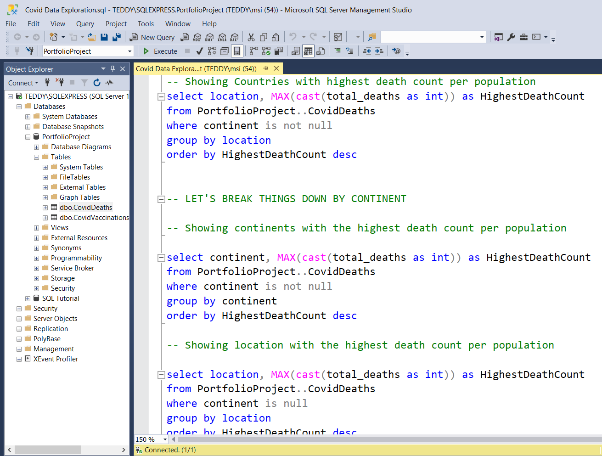

## Joining both tables for Total Population V/S Vaccinations

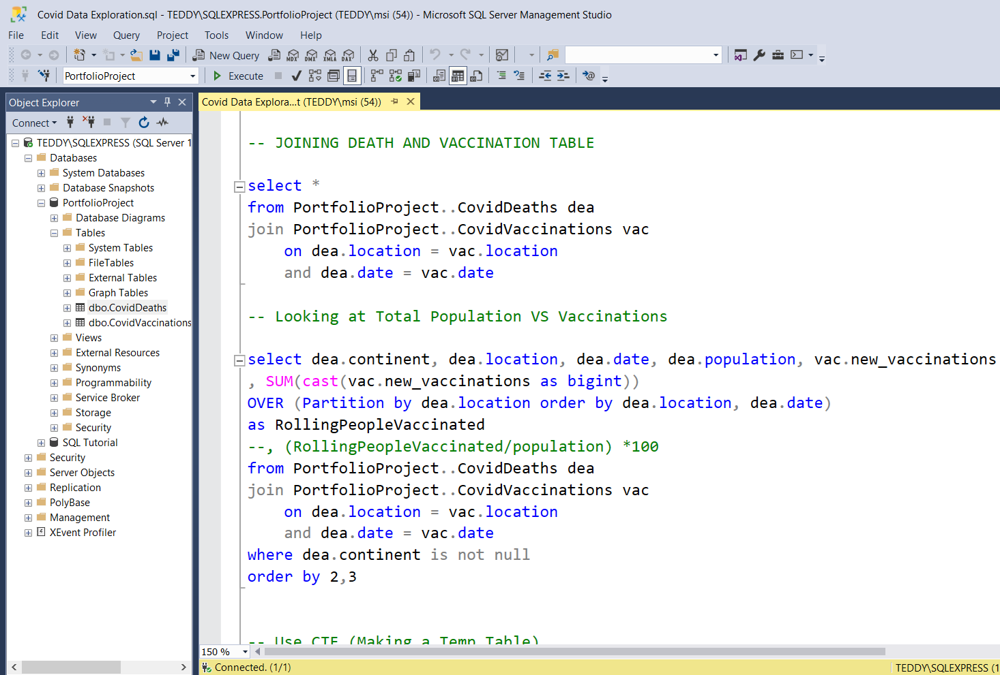

## Using CTE to make Temp Table

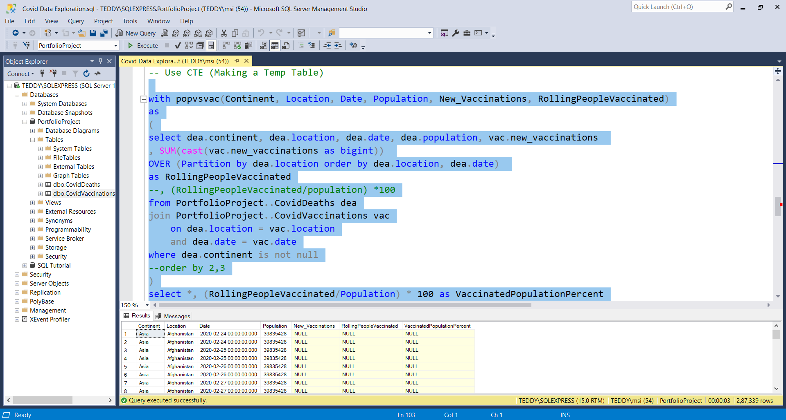

## Temp Table Created

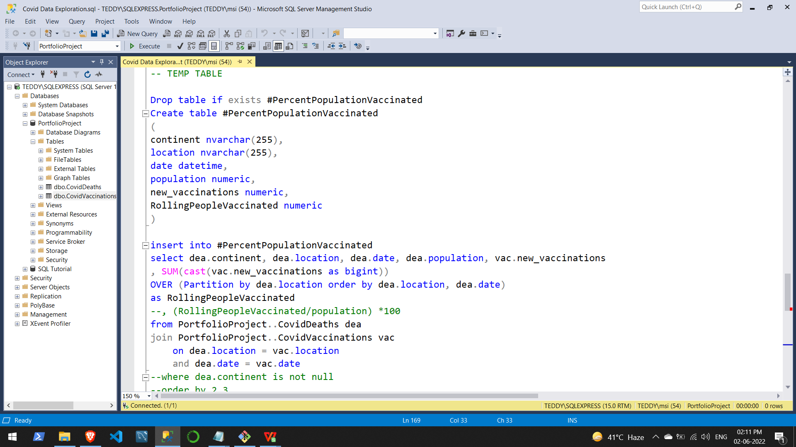

## View Query for Visualization

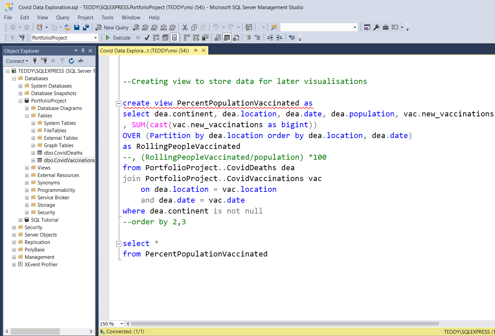

# Created Tableau Tables using SQL Queries and Dashboard using Tableau Public

Using the MS SQL SMS created SQL queries to make tableau tables for visualizations.

## SQL Tableau Table Query 1

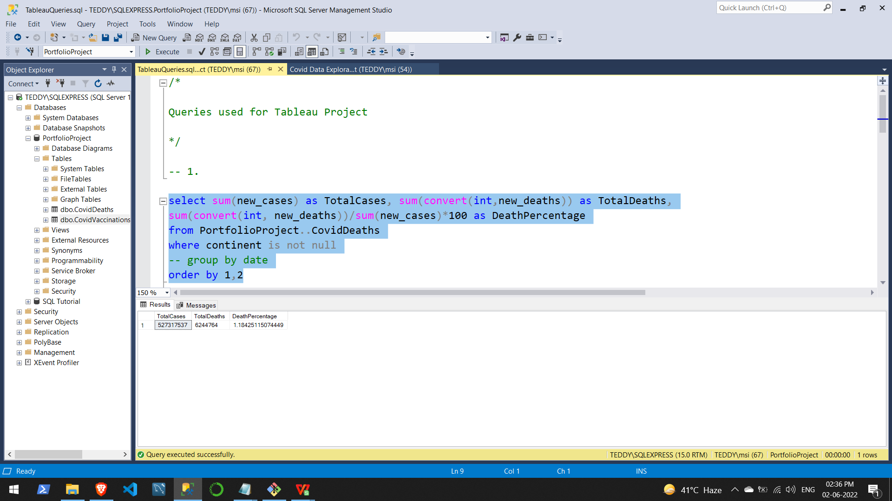

## SQL Tableau Table Query 2

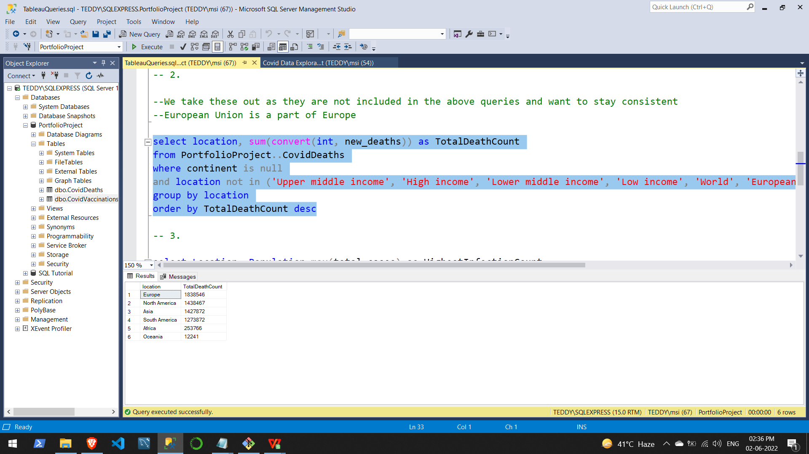

## SQL Tableau Table Query 3

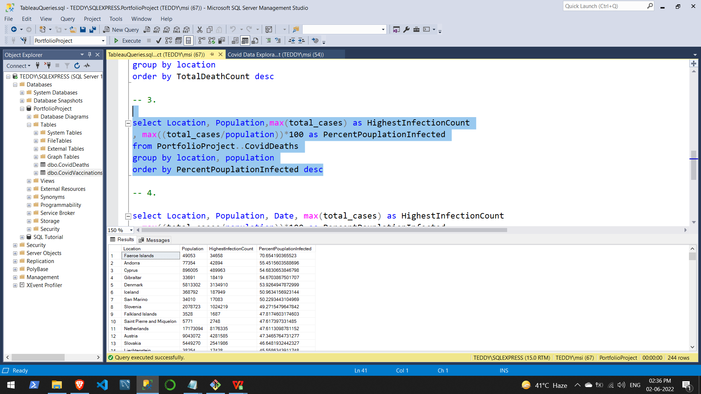

## SQL Tableau Table Query 4

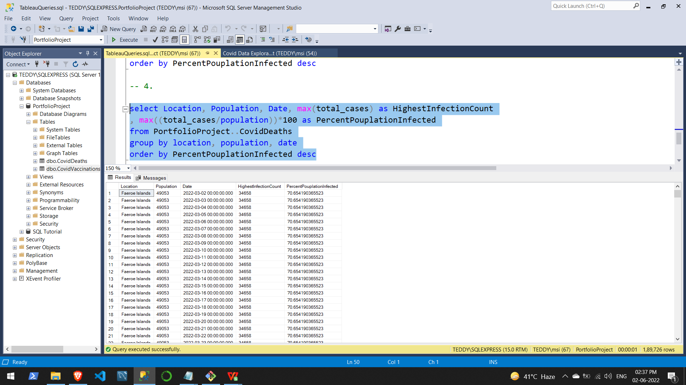

# Tableau Tables for Visualizations

## Tableau Table 1

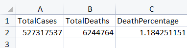

## Tableau Table 2

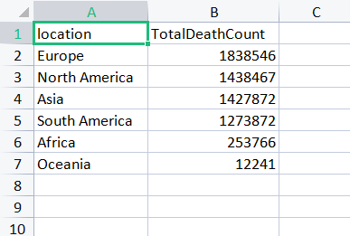

## Tableau Table 3

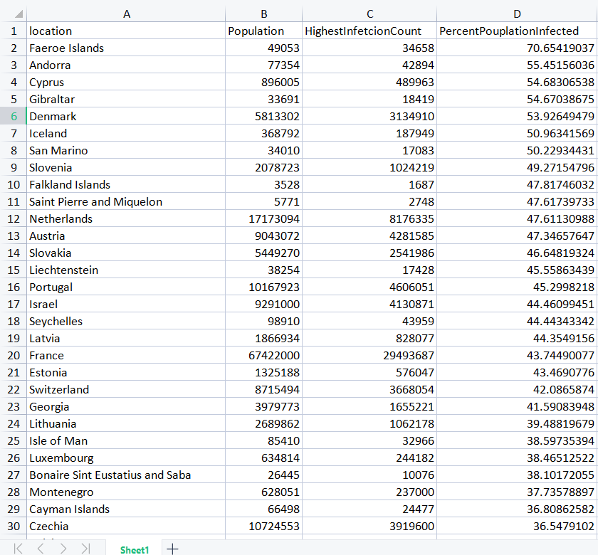

## Tableau Table 4

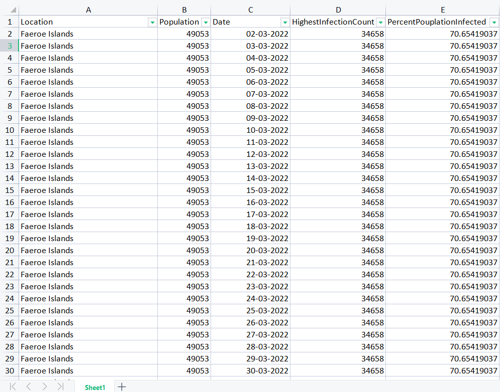

## At Last Created the Dashboard with all the tables included.

# Tableau Dashboard

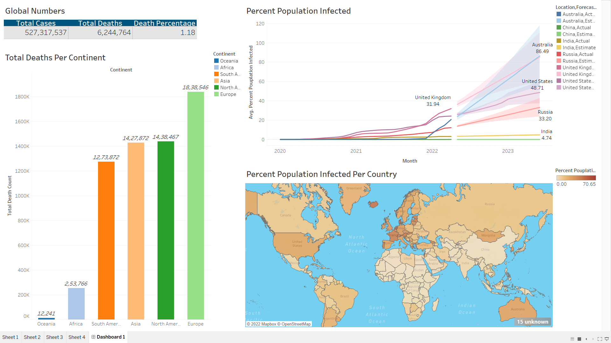

## Done Data Exploration and Visualization of the COVID 19 Dataset using MS Excel, MS SQL SMS, Tableau.
